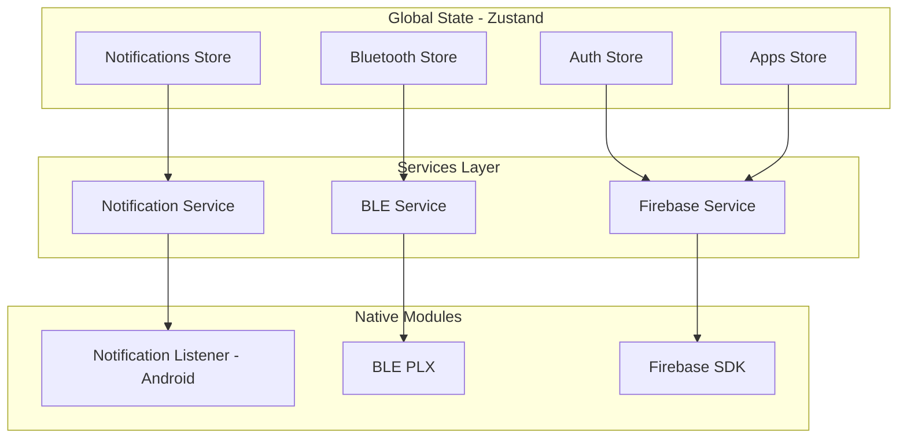
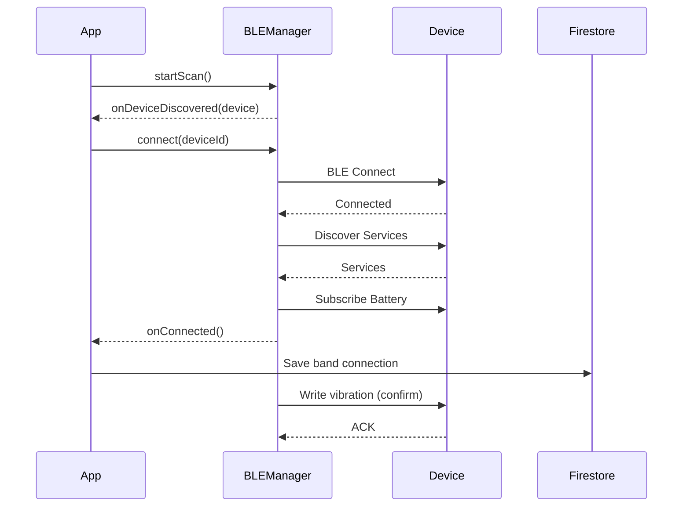
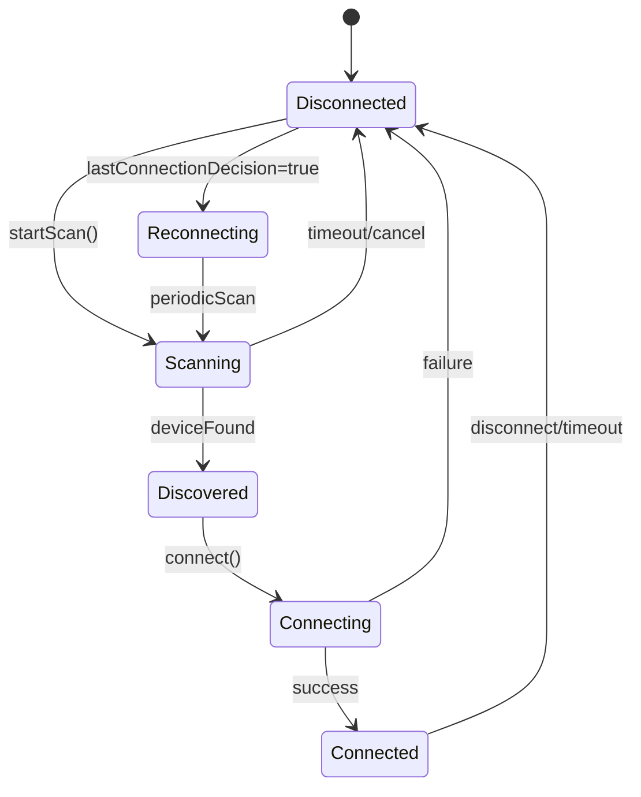
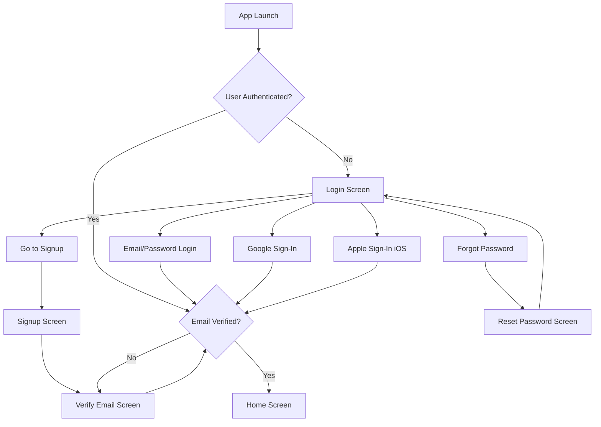
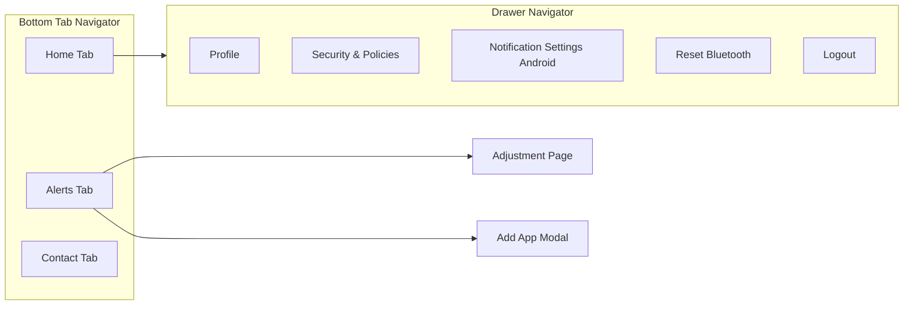
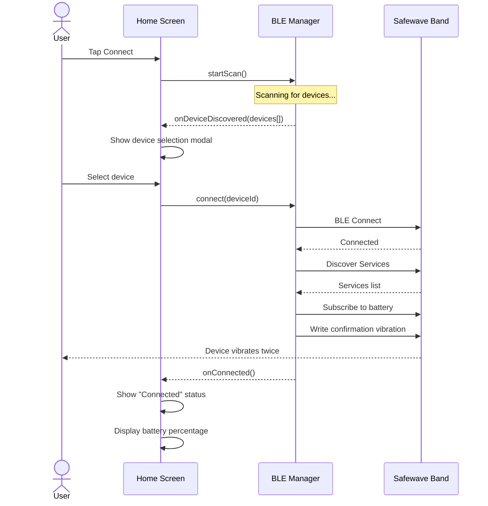

# Safewave Mobile App - React Native Migration PRD

## Executive Summary

Migrate the existing Flutter-based Safewave mobile application to React Native to leverage developer expertise in the React ecosystem while maintaining full feature parity. The app enables users to connect their Safewave Band wearable device via Bluetooth BLE and receive configurable haptic notifications from selected mobile applications.---

## 1. Product Overview

### 1.1 Purpose

The Safewave app allows hearing-impaired users to receive tactile/haptic notifications on their Safewave Band wearable when specific mobile app notifications occur.

### 1.2 Target Platforms

- iOS 13.0+
- Android 8.0+ (API 26+)

### 1.3 Current Tech Stack (Flutter)

| Component | Current Library ||-----------|-----------------|| BLE | flutter_blue_plus, flutter_reactive_ble || Auth | firebase_auth, google_sign_in, sign_in_with_apple || Database | cloud_firestore, sqflite || Notifications | awesome_notifications, firebase_messaging || State Management | provider |

### 1.4 Proposed Tech Stack (React Native)

| Component | Proposed Library ||-----------|------------------|| Framework | React Native 0.73+ with TypeScript || BLE | react-native-ble-plx || Auth | @react-native-firebase/auth, @react-native-google-signin, react-native-apple-authentication || Database | @react-native-firebase/firestore, react-native-sqlite-storage || Notifications | notifee, @react-native-firebase/messaging || State Management | Zustand or Redux Toolkit || Navigation | React Navigation 6 |---

## 2. Feature Requirements

### 2.1 Authentication Module

Complete Firebase-based authentication system.**Functional Requirements:**

- Email/password registration with validation
- Email/password login
- Google Sign-In (both platforms)
- Apple Sign-In (iOS only)
- Email verification flow
- Password reset via email
- Session persistence
- User profile management (display name, email update, password change)
- Account deletion with cascade delete of user data

**Data Model - User:**

```typescript
interface User {
  uid: string;
  email: string;
  displayName: string;
  photoURL?: string;
  emailVerified: boolean;
  bands: Band[];
}
```


### 2.2 Bluetooth BLE Module

Core functionality for Safewave Band connectivity.**Functional Requirements:**| Feature | Description ||---------|-------------|| Device Discovery | Scan for BLE devices with HID service (UUID: 1812) || Connection Management | Connect, disconnect, auto-reconnect logic || Battery Monitoring | Subscribe to battery characteristic, display percentage || Vibration Control | Write vibration commands (strength, count, duty cycle, delay) || Device Naming | Update band display name via BLE characteristic || App Settings Sync | Write app notification configs to band || OTA Updates | Download and transfer firmware updates via BLE || Connection Persistence | Remember and auto-reconnect to last connected device |**BLE UUIDs (from current implementation):**

- Service UUID: `1812` (HID Service)
- Battery UUID: Battery characteristic
- Test/Vibration UUID: Custom vibration characteristic
- App Settings UUID: Custom settings characteristic
- Display Name UUID: Custom name characteristic

**Connection State Machine:**

```javascript
DISCONNECTED -> SCANNING -> DISCOVERED -> CONNECTING -> CONNECTED
     ^                                                      |
     |___________________ RECONNECTING ___________________|
```


### 2.3 Alerts/App Configuration Module

Configure which apps trigger band notifications.**Functional Requirements:**

- Display grid of installed apps with icons
- Toggle app notifications on/off
- Configure per-app vibration settings:
- Strength (1-100)
- Number of vibrations (1-10)
- Sync app configurations to Firestore
- Sync configurations to connected band via BLE
- Platform-specific app detection (Android: native app query, iOS: curated list from JSON)

**Data Model - App Configuration:**

```typescript
interface AppConfig {
  bundleIdentifier: string;
  name: string;
  enabled: boolean;
  imgURL: string; // iOS
  imageData?: Uint8Array; // Android (app icon bitmap)
  userId: string;
  bandId: string;
  appPlatform: 'android' | 'ios';
  config: {
    numberOfVibrations: number;
    strength: number;
  };
}
```


### 2.4 Notification Listener Module

Intercept and forward notifications to the band.**Android Implementation:**

- Use NotificationListenerService native module
- Request notification access permission
- Listen for notifications from enabled apps
- Extract app identifier and trigger band vibration

**iOS Implementation:**

- Subscribe to BLE notification source characteristic
- Process incoming bundle identifiers
- Match against enabled apps and trigger vibration

### 2.5 History Module

Track notification history.**Functional Requirements:**

- Store notification events in Firestore
- Display last 14 days of notifications
- Group by date
- Auto-delete records older than 14 days
- Offline support with sync on reconnection
- Delete individual history items

**Data Model - History:**

```typescript
interface HistoryItem {
  id: string;
  date: Date;
  appName: string;
  bundleIdentifier: string;
  userId: string;
  message: string;
  imgURL: string;
}
```


### 2.6 Push Notifications Module

Local and remote push notification support.**Functional Requirements:**

- Battery low alerts (20%, 10%, 5%)
- Firmware update available notifications
- Download progress notifications
- Firebase Cloud Messaging integration

### 2.7 OTA Firmware Updates

Over-the-air band firmware updates.**Functional Requirements:**

- Check for firmware updates from Firestore
- Download firmware binary
- Transfer firmware to band via BLE chunked writes
- Progress indication
- Validation and retry logic
- Pre-update checks (battery level >= 80%, Bluetooth on)

### 2.8 Settings/Drawer Module

User settings and navigation.**Screens:**

- Profile Page (edit name, email, password)
- Security & Privacy (links to policies)
- Help/Contact (submit support requests)
- Reset Bluetooth Configuration
- Logout

---

## 3. Architecture

### 3.1 Folder Structure

```javascript
src/
├── components/          # Reusable UI components
├── screens/             # Screen components
│   ├── auth/            # Login, Signup, ForgotPassword, VerifyEmail
│   ├── home/            # Home, Alerts, History
│   └── settings/        # Profile, Security, Help
├── services/            # Business logic
│   ├── bluetooth/       # BLE manager, device manager
│   ├── firebase/        # Auth, Firestore, Messaging
│   ├── notifications/   # Local & push notification handlers
│   └── storage/         # SQLite, AsyncStorage
├── store/               # State management (Zustand/Redux)
├── hooks/               # Custom React hooks
├── types/               # TypeScript interfaces
├── utils/               # Helpers, constants
├── navigation/          # React Navigation setup
└── assets/              # Images, fonts
```


### 3.2 State Management Architecture




### 3.3 BLE Connection Flow



---

## 4. Native Module Requirements

### 4.1 Android Native Modules

| Module | Purpose ||--------|---------|| NotificationListenerService | Intercept notifications from enabled apps || Installed Apps Query | Get list of installed apps with icons |

### 4.2 iOS Native Modules

- BLE notification source handling is managed by react-native-ble-plx

---

## 5. Data Flow

### 5.1 Firestore Collections

| Collection | Purpose ||------------|---------|| users | User profiles and band associations || applications | Per-user app notification configurations || history | Notification history records || global_variables | Firmware version, update availability || contact_submissions | Support contact form submissions |

### 5.2 Local Storage

| Storage | Data ||---------|------|| AsyncStorage | Last connection decision, device IDs, preferences || SQLite | Offline cache for apps, history (optional for offline mode) |---

## 6. UI/UX Requirements

### 6.1 Design System

- Dark theme primary (matching current app)
- Primary color: #00151E (dark blue)
- Accent color: #1DAAE1 (cyan blue)
- Font: System default or Google Fonts equivalent

### 6.2 Screen List

| Screen | Description ||--------|-------------|| Splash | App logo with loading indicator || Login | Email/password, Google, Apple sign-in || Signup | Registration form || Forgot Password | Password reset email || Verify Email | Email verification prompt || Home | Connection status, battery, quick actions || Alerts | App grid for notification config || Adjustment | Per-app vibration settings || History | Notification history list || Profile | User profile editing || Security | Privacy policy, terms links || Help | Contact form || Band Update | Firmware update UI |---

## 7. Dependencies (package.json)

```json
{
  "dependencies": {
    "react-native": "0.73.x",
    "@react-navigation/native": "^6.x",
    "@react-navigation/bottom-tabs": "^6.x",
    "@react-navigation/drawer": "^6.x",
    "react-native-ble-plx": "^3.x",
    "@react-native-firebase/app": "^18.x",
    "@react-native-firebase/auth": "^18.x",
    "@react-native-firebase/firestore": "^18.x",
    "@react-native-firebase/messaging": "^18.x",
    "@react-native-google-signin/google-signin": "^11.x",
    "@invertase/react-native-apple-authentication": "^2.x",
    "@notifee/react-native": "^7.x",
    "zustand": "^4.x",
    "react-native-permissions": "^4.x",
    "react-native-fs": "^2.x",
    "@react-native-async-storage/async-storage": "^1.x",
    "react-native-sqlite-storage": "^6.x",
    "react-native-fast-image": "^8.x",
    "react-native-linear-gradient": "^2.x",
    "react-native-vector-icons": "^10.x"
  }
}
```

---

## 8. Migration Risk Assessment

| Risk | Severity | Mitigation ||------|----------|------------|| BLE complexity | High | Use react-native-ble-plx which is mature; test on real devices early || Android Notification Listener | Medium | Requires native module; existing Flutter code provides logic reference || OTA Updates | Medium | Port chunked write logic carefully; implement proper error handling || iOS App Icons | Low | Use existing JSON data files for curated app list || Offline Sync | Low | Firestore has good offline support; SQLite optional |---

## 9. Testing Strategy

- Unit tests for business logic (Jest)
- Integration tests for Firebase operations
- E2E tests for critical flows (Detox)
- Manual BLE testing on real devices (required - emulators don't support BLE properly)

---

## 10. Implementation Phases

### Phase 1: Foundation (Weeks 1-2)

Project setup, navigation, authentication

### Phase 2: Bluetooth Core (Weeks 3-5)

BLE scanning, connection, battery monitoring, vibration control

### Phase 3: Notifications (Weeks 6-7)

Android notification listener, app configuration

### Phase 4: Features (Weeks 8-9)

History, OTA updates, push notifications

### Phase 5: Polish (Week 10)

UI refinement, testing, bug fixes---

## 11. Key Files to Reference

The following Flutter files contain critical business logic to port:

- [`lib/Bluetooth/bluetooth_provider.dart`](lib/Bluetooth/bluetooth_provider.dart) - BLE state management (1687 lines)
- [`lib/services/firestore.dart`](lib/services/firestore.dart) - Firestore operations
- [`lib/services/auth.dart`](lib/services/auth.dart) - Authentication logic
- [`lib/alerts/apps_provider.dart`](lib/alerts/apps_provider.dart) - App configuration state
- [`lib/Bluetooth/bluetooth_device_manager.dart`](lib/Bluetooth/bluetooth_device_manager.dart) - Low-level BLE operations
- [`lib/Bluetooth/bluetooth_constants.dart`](lib/Bluetooth/bluetooth_constants.dart) - BLE UUIDs and constants

---

## 12. Detailed BLE Protocol Specification

### 12.1 Service and Characteristic UUIDs

| UUID | Name | Type | Properties | Description ||------|------|------|------------|-------------|| `0000fffe-0000-1000-8000-00805f9b34fb` | Main Service | Service | - | Primary Safewave Band service || `00001812-0000-1000-8000-00805f9b34fb` | HID Service | Service | - | Human Interface Device service for pairing || `0000180f-0000-1000-8000-00805f9b34fb` | Battery Service | Service | - | Standard battery service || `0000180a-0000-1000-8000-00805f9b34fb` | Device Info Service | Service | - | Device information service |

### 12.2 Characteristic UUIDs (Custom Safewave)

| UUID | Name | Properties | Data Format ||------|------|------------|-------------|| `81b2497c-8230-11ed-a1eb-0242ac120002` | App Settings | Read, Write, WriteNoResponse, Notify | String: `bundleId, strength, numBuzzes, dutyOfBuzz, durationOfDelay;` || `12d9cf1a-751b-11ed-a1eb-0242ac120002` | Test/Vibration | Write, WriteNoResponse | `[strength, numBuzzes, dutyOfBuzz, durationOfDelay]` (4 bytes) || `47cd799a-8233-11ed-a1eb-0242ac120002` | Battery Status | Read, Notify | `[batteryLevel, isCharging]` (2 bytes) || `543eff2a-751b-11ed-a1eb-0242ac120002` | Display Name | Read, Write, WriteNoResponse | UTF-8 encoded hex string |

### 12.3 OTA Update Service UUIDs

| UUID | Name | Properties | Description ||------|------|------------|-------------|| `02F00000-0000-0000-0000-00000000FE00` | OTA Service | Service | Firmware update service || `02f00000-0000-0000-0000-00000000ff00` | OTA Char 0 | Read | OTA status/info || `02f00000-0000-0000-0000-00000000ff01` | OTA Char 1 | Write, WriteNoResponse | Firmware data chunks || `02f00000-0000-0000-0000-00000000ff02` | OTA Char 2 | Read, Notify | Transfer progress || `02f00000-0000-0000-0000-00000000ff03` | OTA Char 3 | Read | OTA metadata |

### 12.4 Vibration Command Format

```typescript
interface VibrationCommand {
  strength: number;        // 0-100 (vibration intensity percentage)
  numBuzzes: number;       // 1-10 (number of vibration pulses)
  dutyOfBuzz: number;      // 10-100 (duty cycle, default: 50)
  durationOfDelay: number; // 10-100 (delay between buzzes in ms, default: 50)
}

// Special commands
const SHUTOFF_BAND = [0xFF, 0xAA]; // Turns band off and disconnects
```


### 12.5 App Settings Sync Format

```typescript
// Format: " bundleId, strength, numBuzzes, dutyOfBuzz, durationOfDelay;"
// Example:
const appSettingsString = " com.apple.MobileSMS, 100, 2, 10, 10; com.apple.mobilephone, 75, 3, 10, 10;";

// Note: If bundleId UTF-8 byte length % 20 == 0, append extra semicolon
```


### 12.6 Battery Status Data Format

```typescript
interface BatteryStatus {
  batteryLevel: number;  // 0-100 (percentage) - byte 0
  isCharging: boolean;   // 1 = charging, 0 = not charging - byte 1
}
```


### 12.7 Connection State Machine



---

## 13. Firestore Schema (Detailed)

### 13.1 Users Collection

```typescript
// Collection: users/{userId}
interface UserDocument {
  displayName: string;
  email: string;
  bands: BandReference[];
  lastOnline?: Timestamp;
}

interface BandReference {
  bandId: string;           // BLE device remoteId
  status: string;           // "true" | "false"
  lastConnectedDate: string; // ISO 8601 timestamp
}
```


### 13.2 Applications Collection

```typescript
// Collection: application/{docId}
interface ApplicationDocument {
  enabled: boolean;
  name: string;
  bundleIdentifier: string;
  imgURL: string;           // iOS only (empty for Android)
  userId: string;
  bandId: string;
  appPlatform: 'android' | 'ios';
  config: {
    numberOfVibrations: number;  // 1-10
    strength: number;            // 1-100
    secondaryNumberOfVibrations?: number;
    secondaryStrength?: number;
    phrases?: string[];          // Keywords for priority notifications
  };
}
```


### 13.3 History Collection

```typescript
// Collection: history/{docId}
interface HistoryDocument {
  appName: string;
  bundleIdentifier: string;
  userId: string;
  message: string;
  date: Timestamp;  // Auto-deleted after 14 days
}
```


### 13.4 Global Variables Collection

```typescript
// Collection: GlobalVariables/FirmwareUpdate
interface FirmwareUpdateDocument {
  updateAvailable: boolean;
  version: string;      // e.g., "1.5"
  url: string;          // Download URL for firmware binary
}

// Collection: GlobalVariables/2z5kYl7h1g7cSgyRRGfT
interface FirmwareVersionDocument {
  version: string;
  url: string;
}
```


### 13.5 iOS Available Apps Collection

```typescript
// Collection: iOS_available_apps/{docId}
interface IOSAppDocument {
  appName: string;
  bundleId: string;
  imgURL: string;
}
```


### 13.6 Contact Submissions Collection

```typescript
// Collection: contact_submissions/{docId}
interface ContactSubmissionDocument {
  name: string;
  email: string;
  message: string;
  timestamp: Timestamp;
  status: 'new' | 'handled';
}
```

---

## 14. Native Module Specifications

### 14.1 Android: NotificationListenerService

**Purpose:** Intercept notifications from installed apps and forward to the Safewave Band.**Implementation Path:** `android/app/src/main/java/com/safewave/NotificationListener.java`

```java
// NotificationListenerService implementation
public class SafewaveNotificationListener extends NotificationListenerService {
    
    @Override
    public void onNotificationPosted(StatusBarNotification sbn) {
        String packageName = sbn.getPackageName();
        // Send to React Native via EventEmitter
        sendEvent("onNotificationReceived", packageName);
    }
    
    @Override
    public void onNotificationRemoved(StatusBarNotification sbn) {
        // Optional: track notification dismissals
    }
}
```

**React Native Bridge:**

```typescript
// src/services/notifications/AndroidNotificationListener.ts
import { NativeModules, NativeEventEmitter } from 'react-native';

const { NotificationListenerModule } = NativeModules;
const eventEmitter = new NativeEventEmitter(NotificationListenerModule);

export const NotificationListener = {
  isEnabled: (): Promise<boolean> => 
    NotificationListenerModule.isNotificationListenerEnabled(),
  
  requestPermission: (): Promise<void> =>
    NotificationListenerModule.requestNotificationListenerPermission(),
  
  subscribe: (callback: (packageName: string) => void) => {
    return eventEmitter.addListener('onNotificationReceived', callback);
  }
};
```

**Required Android Manifest:**

```xml
<service
    android:name=".SafewaveNotificationListener"
    android:permission="android.permission.BIND_NOTIFICATION_LISTENER_SERVICE"
    android:exported="false">
    <intent-filter>
        <action android:name="android.service.notification.NotificationListenerService" />
    </intent-filter>
</service>
```


### 14.2 Android: Installed Apps Query

**Purpose:** Get list of installed apps with icons for the Alerts screen.

```java
// InstalledAppsModule.java
@ReactMethod
public void getInstalledApps(Promise promise) {
    PackageManager pm = getReactApplicationContext().getPackageManager();
    List<ApplicationInfo> apps = pm.getInstalledApplications(0);
    
    WritableArray result = Arguments.createArray();
    for (ApplicationInfo app : apps) {
        if (pm.getLaunchIntentForPackage(app.packageName) != null) {
            WritableMap appMap = Arguments.createMap();
            appMap.putString("packageName", app.packageName);
            appMap.putString("appName", pm.getApplicationLabel(app).toString());
            // Get icon as base64
            appMap.putString("icon", getIconBase64(app));
            result.pushMap(appMap);
        }
    }
    promise.resolve(result);
}
```

**React Native Interface:**

```typescript
// src/services/apps/InstalledApps.ts
import { NativeModules, Platform } from 'react-native';

interface InstalledApp {
  packageName: string;
  appName: string;
  icon: string; // Base64 encoded
}

export const getInstalledApps = async (): Promise<InstalledApp[]> => {
  if (Platform.OS === 'android') {
    return NativeModules.InstalledAppsModule.getInstalledApps();
  }
  // iOS: Load from curated JSON file
  return require('../../assets/data/aggregate.json');
};
```


### 14.3 iOS: App Search API

**Purpose:** Search iTunes API for iOS apps (since we can't query installed apps).

```typescript
// src/services/apps/IOSAppSearch.ts
interface ITunesSearchResult {
  trackName: string;
  bundleId: string;
  artworkUrl512: string;
}

export const searchIOSApps = async (term: string): Promise<ITunesSearchResult[]> => {
  const url = `https://itunes.apple.com/search?term=${encodeURIComponent(term)}&entity=software&media=software&limit=20`;
  
  const response = await fetch(url);
  const data = await response.json();
  
  return data.results.map((r: any) => ({
    trackName: r.trackName,
    bundleId: r.bundleId,
    artworkUrl512: r.artworkUrl512,
  }));
};
```

---

## 15. Screen Wireframes and User Flows

### 15.1 Authentication Flow




### 15.2 Main App Navigation




### 15.3 Home Screen Layout

```javascript
+------------------------------------------+
|  [Menu]        SAFEWAVE LOGO             |
+------------------------------------------+
|                                          |
|        Welcome, [User Name]!             |
|                                          |
|  +------------------------------------+  |
|  |    [Connection Status Widget]      |  |
|  |                                    |  |
|  |  ⚡ Connected / 🔴 Disconnected    |  |
|  |  Battery: 75% [===========   ]     |  |
|  |                                    |  |
|  |  [Connect/Disconnect Button]       |  |
|  +------------------------------------+  |
|                                          |
|  +------------------------------------+  |
|  |  Quick Actions                     |  |
|  |  [Enable Bluetooth] [Scan Devices] |  |
|  +------------------------------------+  |
|                                          |
|  +------------------------------------+  |
|  |  Status Messages                   |  |
|  |  - Bluetooth: Enabled              |  |
|  |  - Notifications: Enabled          |  |
|  +------------------------------------+  |
|                                          |
+------------------------------------------+
|  [Home]    [Alerts]    [Contact]         |
+------------------------------------------+
```


### 15.4 Alerts Screen Layout

```javascript
+------------------------------------------+
|  [Menu]        SAFEWAVE LOGO        [+]  |
+------------------------------------------+
|                                          |
|  Alerts                                  |
|  ─────────────────────────               |
|  Click on the add button to add apps...  |
|                                          |
|  +------------------------------------+  |
|  |  [App Icon]  [App Icon]            |  |
|  |  Messages    Phone                 |  |
|  |                                    |  |
|  |  [App Icon]  [App Icon]            |  |
|  |  Calendar    Slack                 |  |
|  |                                    |  |
|  |  [App Icon]  [App Icon]            |  |
|  |  WhatsApp    Gmail                 |  |
|  +------------------------------------+  |
|                                          |
+------------------------------------------+
|  [Home]    [Alerts]    [Contact]         |
+------------------------------------------+
```


### 15.5 App Adjustment Screen Layout

```javascript
+------------------------------------------+
|  [<Back]     [App Name]                  |
+------------------------------------------+
|                                          |
|  [Large App Icon]                        |
|                                          |
|  Enabled:  [Toggle Switch]               |
|                                          |
|  ─────────────────────────               |
|  Adjust haptic feedback for notifications|
|                                          |
|  Number of Vibrations                    |
|  Less [━━━━●━━━━━━━━] More               |
|       1  2  3  4  5  6  7  8  9  10      |
|                                          |
|  Notification Strength                   |
|  Less [━━━━━━━━●━━━] More                |
|       10  20  30 ... 100                 |
|                                          |
|  [TEST]                    [SAVE]        |
|                                          |
|  [Delete Connection]                     |
|                                          |
+------------------------------------------+
```


### 15.6 Device Connection Flow



---

## 16. API Contracts

### 16.1 BLE Manager API

```typescript
// src/services/bluetooth/BLEManager.ts

interface BLEManager {
  // Scanning
  startScan(): Promise<void>;
  stopScan(): Promise<void>;
  onDeviceDiscovered: (callback: (device: BLEDevice) => void) => void;
  
  // Connection
  connect(deviceId: string): Promise<void>;
  disconnect(): Promise<void>;
  isConnected(): boolean;
  getConnectedDevice(): BLEDevice | null;
  
  // Characteristics
  readCharacteristic(uuid: string): Promise<number[]>;
  writeCharacteristic(uuid: string, data: number[]): Promise<void>;
  subscribeToCharacteristic(uuid: string, callback: (data: number[]) => void): () => void;
  
  // Battery
  subscribeToBattery(callback: (status: BatteryStatus) => void): () => void;
  
  // Vibration
  vibrate(params: VibrationCommand): Promise<void>;
  
  // App Settings
  syncAppSettings(apps: AppConfig[]): Promise<void>;
  
  // OTA
  startOTAUpdate(firmwarePath: string, onProgress: (pct: number) => void): Promise<void>;
}

interface BLEDevice {
  id: string;
  name: string;
  rssi: number;
  status: 'NEW' | 'READY' | 'PAIRED';
}
```


### 16.2 Auth Service API

```typescript
// src/services/firebase/AuthService.ts

interface AuthService {
  // Auth state
  getCurrentUser(): User | null;
  onAuthStateChanged(callback: (user: User | null) => void): () => void;
  
  // Email/Password
  signInWithEmail(email: string, password: string): Promise<User>;
  signUpWithEmail(email: string, password: string, name: string): Promise<User>;
  sendPasswordResetEmail(email: string): Promise<void>;
  sendEmailVerification(): Promise<void>;
  
  // Social Auth
  signInWithGoogle(): Promise<User>;
  signInWithApple(): Promise<User>; // iOS only
  
  // Profile
  updateProfile(data: { displayName?: string; email?: string }): Promise<void>;
  updatePassword(currentPassword: string, newPassword: string): Promise<void>;
  
  // Account
  deleteAccount(): Promise<void>;
  signOut(): Promise<void>;
}
```


### 16.3 Firestore Service API

```typescript
// src/services/firebase/FirestoreService.ts

interface FirestoreService {
  // User
  createUser(user: User): Promise<void>;
  getUser(userId: string): Promise<UserDocument>;
  updateUser(userId: string, data: Partial<UserDocument>): Promise<void>;
  deleteUser(userId: string): Promise<void>;
  
  // Apps
  getApps(userId: string): Promise<ApplicationDocument[]>;
  createApps(apps: any[], userId: string): Promise<ApplicationDocument[]>;
  updateAppConfig(app: ApplicationDocument, userId: string): Promise<void>;
  deleteApp(app: ApplicationDocument, userId: string): Promise<void>;
  
  // History
  getHistory(userId: string): Promise<HistoryDocument[]>;
  createHistory(data: Omit<HistoryDocument, 'date'>): Promise<void>;
  deleteHistory(historyId: string): Promise<void>;
  
  // Bands
  getUserBands(userId: string): Promise<BandReference[]>;
  setUserBands(userId: string, bands: BandReference[]): Promise<void>;
  
  // Firmware
  getFirmwareInfo(): Promise<FirmwareUpdateDocument>;
  
  // Contact
  submitContactForm(data: { name: string; email: string; message: string }): Promise<void>;
}
```

---

## 17. Color Palette and Design Tokens

```typescript
// src/theme/colors.ts

export const colors = {
  // Primary
  primary: '#00151E',        // Dark blue background
  primaryLight: '#1E1E1E',   // Lighter dark for cards
  
  // Accent
  accent: '#1DAAE1',         // Cyan blue
  accentLight: '#19B7EF',    // Lighter cyan for hover
  
  // Status
  success: '#4CAF50',
  error: '#F44336',
  warning: '#FF9800',
  
  // Text
  textPrimary: '#FFFFFF',
  textSecondary: '#B0B0B0',
  textMuted: '#6B6B6B',
  
  // Backgrounds
  background: '#00151E',
  surface: '#1E1E1E',
  surfaceLight: '#2A2A2A',
  
  // Navigation
  navBackground: '#1E1E1E',
  navActive: '#19B7EF',
  navInactive: '#FFFFFF',
  
  // Dividers
  divider: '#333333',
  border: 'rgba(255, 255, 255, 0.1)',
};

export const spacing = {
  xs: 4,
  sm: 8,
  md: 16,
  lg: 24,
  xl: 32,
  xxl: 48,
};

export const borderRadius = {
  sm: 4,
  md: 8,
  lg: 16,
  xl: 24,
  round: 9999,
};

```