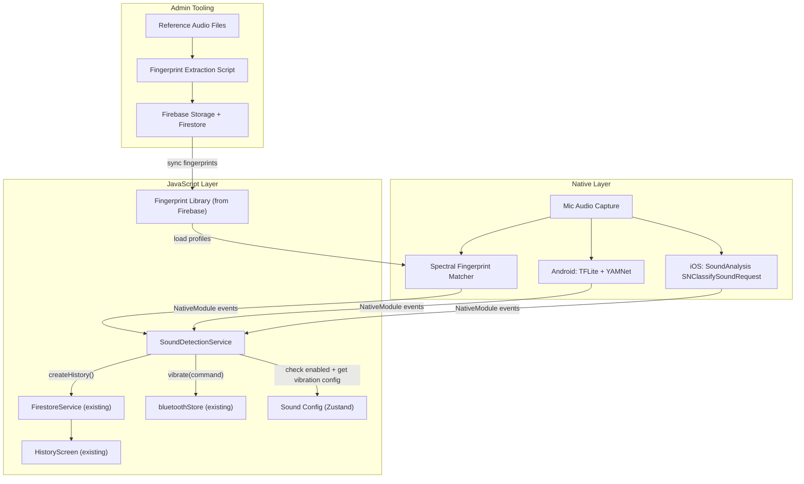
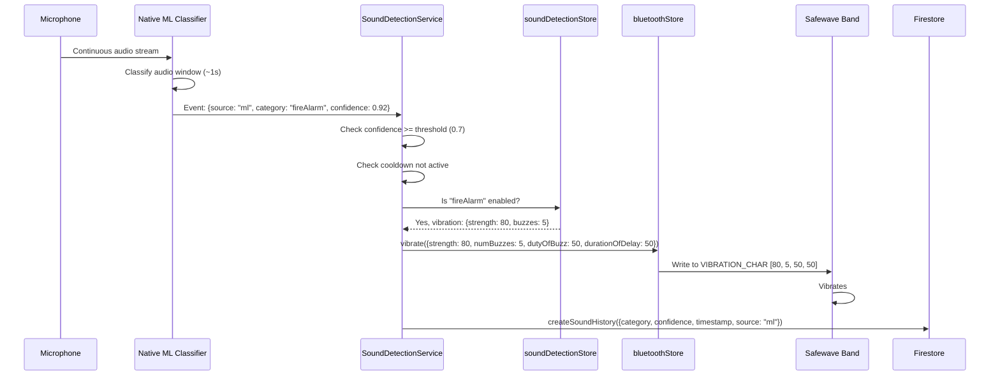
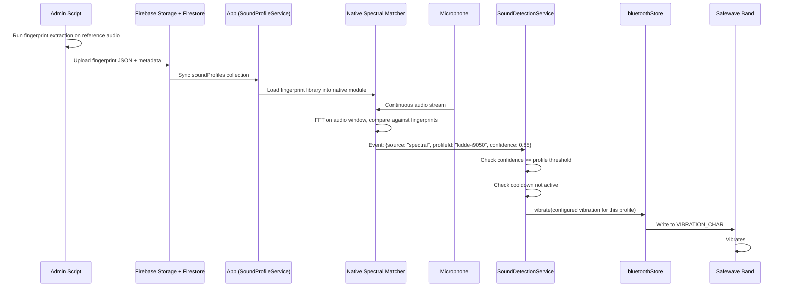

# Safewave Sound Recognition - Product Requirements Document

---

## 1. Overview

### 1.1 Problem Statement

Deaf and hard-of-hearing users cannot hear critical environmental sounds such as fire alarms, carbon monoxide detectors, and baby crying. While Safewave currently alerts users to phone notifications via their wearable band, it does not detect ambient sounds in the user's physical environment.

### 1.2 Solution

Add an ambient sound recognition feature that continuously listens through the phone's microphone, identifies critical sounds, and sends configurable vibration alerts to the connected Safewave band in real-time.

### 1.3 Approach

Two detection methods work together:

- **Built-in categories (ML classifiers):**
  - iOS: Apple's `SoundAnalysis` framework (`SNClassifySoundRequest`) - on-device, Apple-maintained
  - Android: Google's YAMNet model via TensorFlow Lite - on-device, Google-maintained
- **Admin-curated custom sounds (spectral fingerprinting):**
  - Safewave admin uploads reference audio files for specific alarms/sounds
  - System extracts a spectral fingerprint (dominant frequencies + temporal pattern)
  - Fingerprints are stored in Firebase and synced to user devices
  - On-device matching compares live audio against the fingerprint library in parallel with ML classifiers
- **Both run on-device** - no cloud calls, no audio leaves the phone, preserving user privacy
- **Unified JS service layer** abstracts platform differences and merges results from both detection methods

### 1.4 Why Not a Fully Custom ML Model?

- Fire alarms, CO detectors, and baby crying are **standardized, well-studied sounds** - Apple and Google already handle them well
- A custom model would take 6-12 months of dedicated ML work and likely produce inferior results for these categories
- The native audio pipeline (microphone capture, background execution) is the hard part regardless of detection method
- **Spectral fingerprinting fills the gap** for specific sounds not in ML categories, without requiring ML training
- **Future extensibility:** YAMNet can be used as a feature extractor for transfer learning if more advanced custom detection is needed later

---

## 2. User Stories

### Primary

- **US-1:** As a deaf user, I want my Safewave band to vibrate when my fire alarm goes off, so I can evacuate safely.
- **US-2:** As a hard-of-hearing parent, I want my band to vibrate when my baby cries, so I don't miss my child's needs.
- **US-3:** As a user, I want to choose which sounds trigger alerts and configure the vibration pattern for each, so I can distinguish between different alerts by feel.

### Secondary

- **US-4:** As a user, I want sound detection to work even when my phone is locked or the app is in the background, so I'm always protected.
- **US-5:** As a user, I want to see a history of detected sounds, so I can review what was detected and when.
- **US-6:** As a user, I want to test that sound detection is working by triggering a test alert.

---

## 3. Supported Sound Categories (Tier 1 Launch)

| Sound Category           | Apple SoundAnalysis Label    | YAMNet Label                                | Priority |
| ------------------------ | ---------------------------- | ------------------------------------------- | -------- |
| Fire / Smoke Alarm       | `fireAlarm`, `smokeDetector` | `Smoke detector, smoke alarm`, `Fire alarm` | P0       |
| Carbon Monoxide Detector | `alarm` (mapped)             | `Carbon monoxide detector`                  | P0       |
| Baby Crying              | `babyCrying`                 | `Baby cry, infant cry`                      | P1       |

### Tier 2: Admin-Curated Custom Sound Profiles (Launch)

Safewave admin (developer) can upload reference audio files for any specific sound. These are processed into spectral fingerprints and distributed to all user devices via Firebase.

- Any electronic/synthetic alarm sound (specific brands, models, industrial)
- Medical device alerts
- Custom alert tones
- Any consistent, repeating sound that a customer requests

No ML training required - uses spectral fingerprint matching (FFT-based frequency and temporal pattern comparison).

### Future categories (can be enabled with no model changes):

- Siren (ambulance, police, tornado)
- Doorbell / door knock
- Glass breaking
- Dog barking
- Phone ringing
- Car horn
- Shouting / screaming

These are all already supported by both Apple SoundAnalysis and YAMNet. Enabling them is a configuration change, not a model change.

---

## 4. Feature Requirements

### 4.1 Sound Detection Engine

**FR-1:** The app SHALL continuously capture audio from the device microphone when sound detection is enabled.

**FR-2:** Audio processing SHALL run entirely on-device. No audio data shall be transmitted to any server.

**FR-3:** On iOS, the app SHALL use Apple's `SoundAnalysis` framework with `SNClassifySoundRequest(version:)` for sound classification.

**FR-4:** On Android, the app SHALL use TensorFlow Lite with Google's YAMNet model for sound classification.

**FR-5:** The detection engine SHALL process audio in near-real-time with a maximum latency of 2 seconds from sound onset to classification result.

**FR-6:** Classification results SHALL only trigger alerts when the confidence score exceeds a configurable threshold (default: 0.7 / 70%).

**FR-7:** The engine SHALL implement a cooldown period (default: 30 seconds) per sound category to prevent repeated alerts from continuous alarm sounds.

### 4.2 Background Execution

**FR-8:** On Android, sound detection SHALL run as a foreground service with a persistent notification (e.g., "Safewave is listening for sounds"). This can extend the existing `BLEForegroundService` or run as a separate service.

**FR-9:** On iOS, sound detection SHALL run in the background using the `audio` background mode (`UIBackgroundModes: ["audio"]`) in addition to the existing `bluetooth-central` mode.

**FR-10:** The app SHALL gracefully handle microphone interruptions (phone call, other app using mic) and resume listening when the microphone becomes available again.

**FR-11:** The app SHALL display a visible indicator when sound detection is actively listening (microphone icon or status bar indicator).

### 4.3 Vibration Alert Pipeline

**FR-12:** When a sound is detected with sufficient confidence, the app SHALL send a vibration command to the connected Safewave band using the existing BLE vibration pipeline (`BLEManager.vibrate()`).

**FR-13:** Each sound category SHALL have its own configurable vibration pattern (strength, number of buzzes), independent of notification app vibration settings.

**FR-14:** If the band is not connected when a sound is detected, the app SHALL queue the alert and optionally deliver a local push notification to the phone.

### 4.4 User Configuration

**FR-15:** Users SHALL be able to enable/disable sound detection globally via a toggle.

**FR-16:** Users SHALL be able to enable/disable individual sound categories independently.

**FR-17:** Users SHALL be able to configure vibration patterns (strength 10-100, buzzes 1-10) per sound category, using the existing `VibrationConfigModal` component.

**FR-18:** Users SHALL be able to test detection by playing a sound and verifying the band vibrates (test mode).

**FR-19:** Sound detection settings SHALL be persisted in Firestore under the user's profile and synced across sessions.

### 4.5 History and Logging

**FR-20:** Each detected sound event SHALL be logged to Firestore with: timestamp, sound category, confidence score, whether vibration was sent, and whether band was connected.

**FR-21:** Detected sound events SHALL appear in the existing History screen alongside notification events.

### 4.6 Admin Custom Sound Profiles

**FR-24:** The Safewave admin SHALL be able to upload reference audio files (WAV, M4A, MP3; 3-10 seconds duration) for specific sounds to be detected.

**FR-25:** Upon upload, the system SHALL extract a spectral fingerprint from the reference audio, consisting of:

- Dominant frequency peaks (via FFT)
- Temporal pattern (on/off cadence, repetition interval)
- Frequency band energy distribution (mel-scale)

**FR-26:** The fingerprint extraction MAY run as a local dev script (Node.js or Python) during the development phase. It does not need to be a production server pipeline at launch.

**FR-27:** Extracted fingerprints SHALL be stored in a Firestore collection (`soundProfiles`) with metadata: name, description, category label, fingerprint data, confidence threshold, and a reference to the original audio file in Firebase Storage.

**FR-28:** The app SHALL sync the fingerprint library from Firestore on launch and when new profiles are added (real-time listener or periodic check).

**FR-29:** The on-device detection engine SHALL run spectral fingerprint matching in parallel with the ML classifiers on the same audio stream. When incoming audio matches a custom fingerprint above its threshold, it SHALL trigger an alert identically to a built-in category detection.

**FR-30:** Custom sound profiles SHALL appear in the user's sound category list alongside built-in categories, with the same enable/disable toggle and vibration configuration options.

**FR-31:** Spectral matching is best suited for **consistent electronic/synthetic sounds** (alarms, beeps, tones). The admin documentation SHALL note that natural/variable sounds (voices, animal sounds) are better served by the built-in ML categories.

### 4.7 Permissions

**FR-22:** The app SHALL request microphone permission with a clear explanation of why it's needed (e.g., "Safewave needs microphone access to detect fire alarms and other critical sounds around you").

**FR-23:** If microphone permission is denied, sound detection SHALL be disabled and the UI SHALL guide the user to enable it in settings.

---

## 5. Technical Architecture

### 5.1 Component Diagram

### 5.2 New Files to Create

**Native Modules (Expo Config Plugins):**

- `plugins/withSoundRecognition.js` - Expo config plugin that:
  - iOS: Adds `SoundAnalysis.framework`, `audio` background mode, microphone permission strings, generates native `SoundRecognitionModule.swift` (ML classification + spectral matching)
  - Android: Adds TFLite dependencies, microphone permission, generates `SoundRecognitionModule.java` with YAMNet integration + spectral matching, extends foreground service for audio capture

**JavaScript Services:**

- `src/services/SoundDetectionService.ts` - Unified JS service that:
  - Starts/stops the native detection module
  - Receives classification events from native via `NativeEventEmitter` (both ML and spectral match results)
  - Applies confidence threshold filtering
  - Implements cooldown logic
  - Triggers vibration via `bluetoothStore.vibrate()`
  - Logs to Firestore history
  - Handles microphone interruptions
- `src/services/SoundProfileService.ts` - Manages custom sound profiles:
  - Syncs fingerprint library from Firestore `soundProfiles` collection
  - Caches fingerprints locally (AsyncStorage or filesystem)
  - Passes fingerprint data to the native spectral matcher
  - Handles profile updates (new profiles added by admin)

**Admin Tooling (dev-time):**

- `scripts/extract-fingerprint.py` (or `.js`) - CLI script that:
  - Takes a reference audio file as input
  - Runs FFT to extract dominant frequencies and temporal pattern
  - Outputs a JSON fingerprint object
  - Optionally uploads fingerprint + audio to Firebase Storage / Firestore

**State:**

- `src/store/soundDetectionStore.ts` - Zustand store for:
  - Global enabled/disabled toggle
  - Per-category enabled/disabled + vibration config (both built-in and custom)
  - Custom sound profiles (synced from Firestore)
  - Detection status (listening, paused, error)
  - Last detected sounds (for UI display)

**UI Components:**

- `src/components/SoundCategoryItem.tsx` - List item for a sound category (icon, name, enable toggle, vibration config button) - works for both built-in and custom categories
- `src/screens/sounds/SoundDetectionScreen.tsx` - New screen/tab or section within existing Alerts screen

**Types:**

- `src/types/sound.ts` - `SoundCategory`, `SoundDetectionEvent`, `SoundDetectionConfig`, `SoundProfile` (custom fingerprint), `SpectralFingerprint`

**Firestore:**

- `src/services/firebase/FirestoreService.ts` - Extend with:
  - Sound detection config read/write
  - Sound event history
  - Sound profiles collection (custom fingerprints) read + real-time sync

### 5.3 Existing Files to Modify

- `app.json` - Add new plugin, microphone permission strings, `audio` background mode
- `src/navigation/MainTabNavigator.tsx` - Add sound detection entry point (either new tab or section in Alerts)
- `src/screens/alerts/AlertsScreen.tsx` - Potentially add sound detection section
- `src/types/user.ts` - Add sound detection config to user document type
- `src/services/firebase/FirestoreService.ts` - Add sound config and sound event CRUD
- `package.json` - Add `@tensorflow/tfjs`, `@tensorflow/tfjs-react-native`, TFLite dependencies (Android)

### 5.4 Data Flow: Sound Detected to Band Vibration

**Flow A: Built-in ML category detection**

**Flow B: Custom sound profile detection (spectral matching)**

---

## 6. UI/UX Design

### 6.1 Sound Detection Screen

The sound detection feature should be accessible from the **Alerts tab** as a new section, or as its own tab. It should contain:

- **Master toggle:** "Sound Detection" on/off with status indicator ("Listening...", "Off", "Mic unavailable")
- **Sound category list:** Each row shows:
  - Icon representing the sound (flame, baby, warning triangle)
  - Sound name
  - Enable/disable toggle
  - Vibration config button (opens existing `VibrationConfigModal`)
  - Last detected timestamp (if any)
- **Microphone permission prompt:** If permission not granted, show a card explaining why it's needed with a button to open settings

### 6.2 Home Screen Integration

- Add a small status indicator on the Home screen showing sound detection is active (e.g., a mic icon near the band connection status)
- If a sound is currently detected, briefly flash an alert on the Home screen

### 6.3 History Integration

- Sound detection events appear in the existing History screen
- Distinguished from notification events by a different icon/label (e.g., "Fire Alarm Detected" vs "Instagram Notification")
- Show confidence percentage

---

## 7. Non-Functional Requirements

### 7.1 Performance

- Audio classification latency: < 2 seconds
- Battery impact: < 5% additional drain per hour of continuous listening (both Apple SoundAnalysis and YAMNet are optimized for low-power on-device inference)
- Memory: YAMNet model is ~3MB; should not significantly impact app size

### 7.2 Privacy

- All audio processing is on-device
- No audio is recorded, stored, or transmitted
- Only classification results (category + confidence) are stored
- Microphone access is clearly disclosed and user-controlled

### 7.3 Reliability

- Sound detection must work with phone locked and app in background
- Must survive app restarts (auto-resume if enabled)
- Must handle concurrent BLE connection + audio capture without interference
- Must handle microphone conflicts gracefully (pause and resume)

### 7.4 Platform Requirements

- iOS 15+ (SoundAnalysis v2 with improved classifier)
- Android API 26+ (TFLite compatibility)

---

## 8. Future Enhancements (Not in Initial Scope)

### 8.1 ML-Based Custom Sound Detection (Transfer Learning)

- For natural/variable sounds that spectral matching can't handle well
- Use YAMNet as a feature extractor to generate audio embeddings from user-provided samples
- Train a small classification head server-side on those embeddings
- Push the custom model (~100KB) to the device alongside YAMNet

### 8.2 End-User Sound Upload

- Allow end users (not just admin) to record their own sounds for detection
- Would require an in-app recording flow, cloud processing, and quality validation

### 8.3 Additional Built-in Categories

- All categories listed in Section 3 "Future categories" can be enabled with configuration changes only

### 8.4 Sensitivity/Environment Tuning

- Allow users to adjust detection sensitivity per environment (home, office, outdoors)
- Adaptive threshold based on ambient noise level

### 8.5 Multi-Device Support

- Share sound detection settings across multiple Safewave bands
- Family/caregiver notifications when sounds are detected

---

## 9. Implementation Phases

### Phase 1: Native Audio Pipeline + iOS Detection (Weeks 1-3)

- Expo config plugin for iOS with SoundAnalysis integration
- Native audio capture module (shared between ML classifier and spectral matcher)
- Background audio session management
- JS `SoundDetectionService` with event handling
- Basic detection for fire alarm category on iOS

### Phase 2: Android Detection (Weeks 3-5)

- TFLite + YAMNet integration for Android
- Android foreground service extension for audio capture
- Unified JS interface across platforms

### Phase 3: Spectral Fingerprint Matching + Admin Tooling (Weeks 5-7)

- Fingerprint extraction script (Python or Node.js CLI)
- Native spectral matcher module (iOS + Android) running on same audio stream
- `SoundProfileService` for syncing fingerprints from Firestore
- Firestore `soundProfiles` collection schema and CRUD
- Firebase Storage for reference audio files
- Integration with `SoundDetectionService` (merge ML + spectral results)

### Phase 4: Full UI + Configuration (Weeks 7-9)

- Sound detection screen with category management (built-in + custom profiles)
- Per-category vibration configuration
- Firestore persistence of user settings
- History integration (distinguish ML vs. custom detections)

### Phase 5: Polish + Background Reliability (Weeks 9-10)

- Background execution hardening
- Microphone interruption handling
- Battery optimization testing
- Confidence threshold tuning for both ML and spectral matching
- Edge case testing (noise environments, concurrent BLE, multiple profiles)

---

## 10. Risks and Mitigations

| Risk                                               | Impact                               | Mitigation                                                                                                       |
| -------------------------------------------------- | ------------------------------------ | ---------------------------------------------------------------------------------------------------------------- |
| False positives (non-alarm sounds trigger alerts)  | User annoyance, lost trust           | Conservative default threshold (0.7), user-adjustable, cooldown period                                           |
| Battery drain from continuous mic use              | User disables feature                | Use platform-optimized APIs, allow scheduling (e.g., only at night)                                              |
| iOS background audio restrictions                  | Detection stops in background        | Proper `audio` background mode + testing on real devices across iOS versions                                     |
| Microphone conflicts with phone calls              | Missed detections during calls       | Graceful pause/resume, local notification fallback                                                               |
| YAMNet model size increases app bundle             | Larger download                      | Model is ~3MB, acceptable; could lazy-download on first enable                                                   |
| Spectral matching false positives                  | Non-target sounds trigger match      | Per-profile threshold tuning, temporal pattern matching (not just frequency), admin testing before publishing    |
| Spectral matching doesn't work for variable sounds | Missed detections for natural sounds | Clearly document that spectral matching is for electronic/synthetic sounds; use ML categories for natural sounds |
