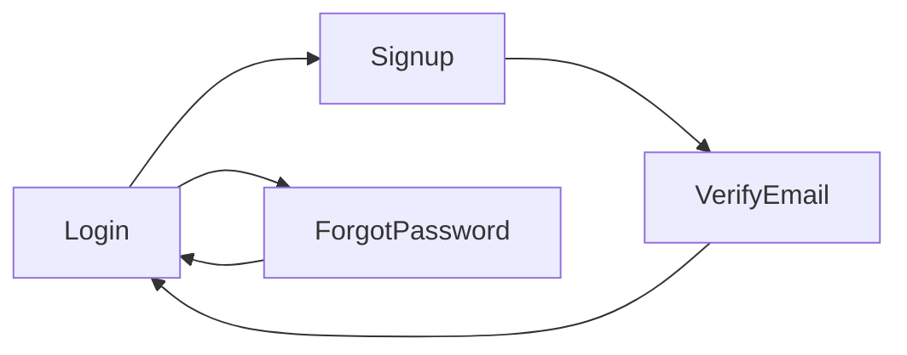

# Stage 1: Auth UI Screens

Build the auth flow UI foundation with navigation and themed screens. Firebase integration will come in a later stage.

## What We're Building

- 4 auth screens: Login, Signup, Forgot Password, Verify Email
- React Navigation stack for auth flow
- Safewave dark theme from PRD
- Reusable form components (inputs, buttons)

## Folder Structure

```javascript
SafewaveMobileApp/
└── src/
    ├── components/
    │   ├── Button.tsx
    │   ├── TextInput.tsx
    │   └── Logo.tsx
    ├── navigation/
    │   └── AuthNavigator.tsx
    ├── screens/
    │   └── auth/
    │       ├── LoginScreen.tsx
    │       ├── SignupScreen.tsx
    │       ├── ForgotPasswordScreen.tsx
    │       └── VerifyEmailScreen.tsx
    └── theme/
        └── colors.ts
```

## Dependencies to Install

```bash
npm install @react-navigation/native @react-navigation/native-stack react-native-screens react-native-gesture-handler
```

## Auth Flow



## Screen Details

| Screen | Key Elements ||--------|-------------|| Login | Email/password inputs, Google/Apple social buttons, links to Signup and Forgot Password || Signup | Name, email, password, confirm password fields, submit button || Forgot Password | Email input, submit button, back to login link || Verify Email | Confirmation message, resend email button, continue to login |

## Theme Reference

Using colors from PRD section 17:

- Background: `#00151E` (dark blue)
- Accent: `#1DAAE1` (cyan)