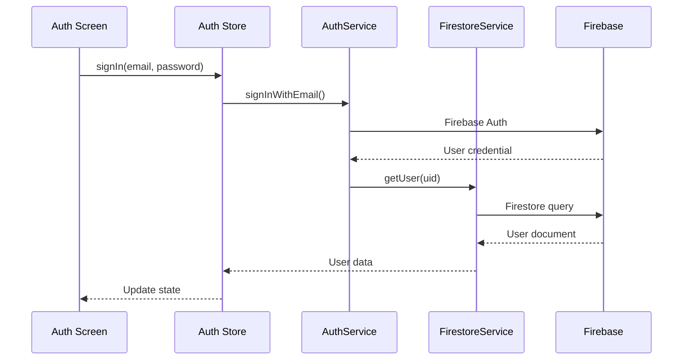

# Stage 2: Firebase Authentication and Firestore

Integrate Firebase Auth and Firestore to make the auth UI functional. This builds on the Stage 1 auth screens.

## Dependencies to Install

```bash
npm install @react-native-firebase/app @react-native-firebase/auth @react-native-firebase/firestore @react-native-google-signin/google-signin @invertase/react-native-apple-authentication
```

## Firebase Console Setup Required

1. Create Firebase project (or use existing)
2. Add iOS and Android apps with bundle IDs
3. Download `google-services.json` (Android) and `GoogleService-Info.plist` (iOS)
4. Enable Email/Password, Google, and Apple sign-in providers

## Folder Structure (additions)

```javascript
SafewaveMobileApp/
└── src/
    ├── services/
    │   └── firebase/
    │       ├── config.ts
    │       ├── AuthService.ts
    │       └── FirestoreService.ts
    ├── store/
    │   └── authStore.ts
    └── types/
        └── user.ts
```

## Auth Flow with Firebase



## Firestore User Schema

From PRD section 13.1:

```typescript
// Collection: users/{userId}
interface UserDocument {
  displayName: string;
  email: string;
  bands: BandReference[];
  lastOnline?: Timestamp;
}
```

## Auth Features

| Feature | Implementation ||---------|---------------|| Email/Password Sign In | `@react-native-firebase/auth` || Email/Password Sign Up | Create auth user + Firestore doc || Google Sign In | `@react-native-google-signin` + Firebase credential || Apple Sign In (iOS) | `@invertase/react-native-apple-authentication` || Email Verification | `sendEmailVerification()` || Password Reset | `sendPasswordResetEmail()` || Session Persistence | Firebase handles automatically |

## Key Files to Create

1. [`src/services/firebase/AuthService.ts`](SafewaveMobileApp/src/services/firebase/AuthService.ts) - All auth operations
2. [`src/services/firebase/FirestoreService.ts`](SafewaveMobileApp/src/services/firebase/FirestoreService.ts) - User document CRUD
3. [`src/store/authStore.ts`](SafewaveMobileApp/src/store/authStore.ts) - Zustand store for auth state
4. [`src/types/user.ts`](SafewaveMobileApp/src/types/user.ts) - TypeScript interfaces

## Native Configuration

**Android:** Add `google-services.json` to `android/app/` and update `build.gradle` files**iOS:** Add `GoogleService-Info.plist` to Xcode project and configure `AppDelegate.swift`

## Connect to Stage 1 Screens

Update auth screens to:

- Call AuthService methods on form submit