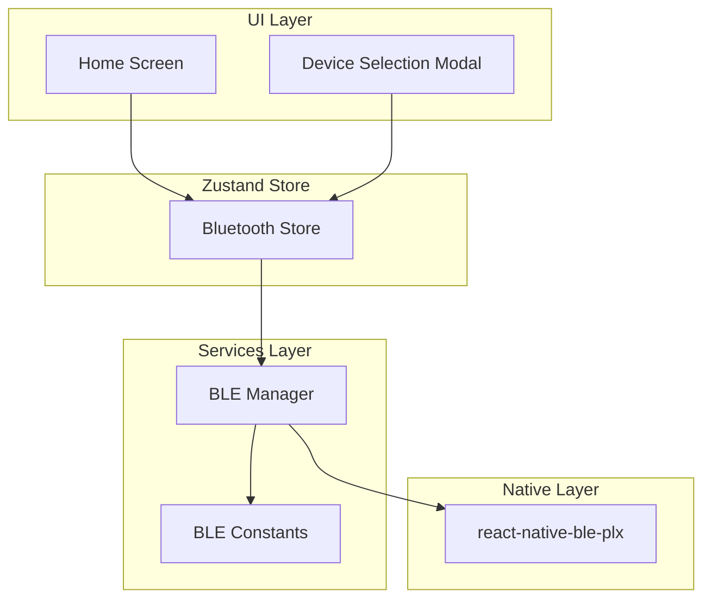
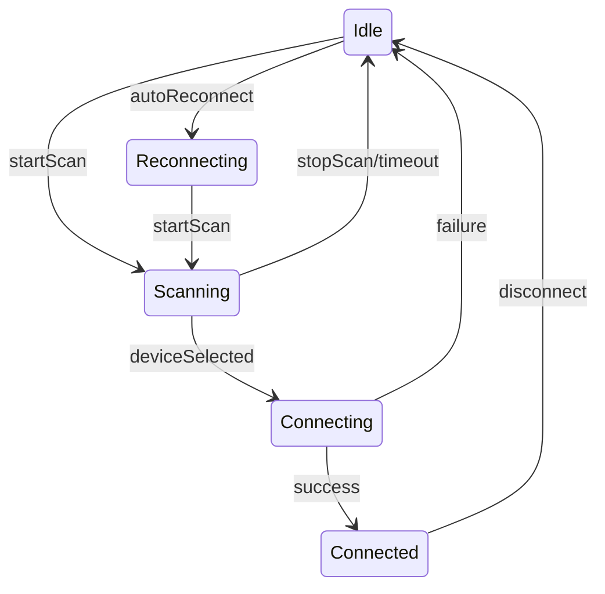

# Stage 3: Bluetooth BLE Core

Implement the core Bluetooth functionality to connect and communicate with the Safewave Band.

## Dependencies to Install

```bash
npm install react-native-ble-plx react-native-permissions @react-native-async-storage/async-storage
```

After installation, run `npx expo prebuild` and `cd ios && pod install` to update native projects.

## Architecture Overview



## Connection State Machine



## File Structure (additions)

```
src/
├── services/
│   └── bluetooth/
│       ├── BLEConstants.ts      # UUIDs and protocol constants
│       ├── BLEManager.ts        # Core BLE operations
│       └── index.ts             # Exports
├── store/
│   └── bluetoothStore.ts        # Zustand BLE state
├── components/
│   └── DeviceSelectionModal.tsx # Device picker modal
└── types/
    └── bluetooth.ts             # BLE TypeScript interfaces
```

## Key Files to Create

### 1. [src/types/bluetooth.ts](SafewaveExpo/src/types/bluetooth.ts)

BLE-related TypeScript interfaces:

- `BLEDevice` - Discovered device info
- `ConnectionState` - State machine states
- `BatteryStatus` - Battery level and charging state
- `VibrationCommand` - Vibration parameters

### 2. [src/services/bluetooth/BLEConstants.ts](SafewaveExpo/src/services/bluetooth/BLEConstants.ts)

UUIDs from PRD Section 12:

- Main Service: `0000fffe-0000-1000-8000-00805f9b34fb`
- HID Service: `00001812-0000-1000-8000-00805f9b34fb`
- Battery Characteristic: `47cd799a-8233-11ed-a1eb-0242ac120002`
- Vibration Characteristic: `12d9cf1a-751b-11ed-a1eb-0242ac120002`
- App Settings Characteristic: `81b2497c-8230-11ed-a1eb-0242ac120002`

### 3. [src/services/bluetooth/BLEManager.ts](SafewaveExpo/src/services/bluetooth/BLEManager.ts)

Core BLE operations:

- `initialize()` - Create BleManager instance, check permissions
- `startScan()` - Scan for devices with HID service UUID
- `stopScan()` - Stop scanning
- `connect(deviceId)` - Connect, discover services, subscribe to battery
- `disconnect()` - Clean disconnect
- `vibrate(command)` - Send vibration command
- `subscribeToBattery(callback)` - Monitor battery level
- Auto-reconnect logic using AsyncStorage for last device

### 4. [src/store/bluetoothStore.ts](SafewaveExpo/src/store/bluetoothStore.ts)

Zustand store with:

- State: `connectionState`, `connectedDevice`, `discoveredDevices`, `batteryLevel`, `isCharging`, `error`
- Actions: `startScan`, `stopScan`, `connect`, `disconnect`, `vibrate`

### 5. [src/components/DeviceSelectionModal.tsx](SafewaveExpo/src/components/DeviceSelectionModal.tsx)

Modal showing discovered devices with:

- List of devices with name and signal strength
- Loading indicator while scanning
- Connect button for each device

### 6. Update [src/screens/home/HomeScreen.tsx](SafewaveExpo/src/screens/home/HomeScreen.tsx)

Integrate BLE functionality:

- Show real connection status and battery level
- Scan button opens device selection modal
- Connect/disconnect functionality
- Test vibration button when connected

## BLE Protocol Implementation

### Vibration Command (4 bytes)

```typescript
// [strength, numBuzzes, dutyOfBuzz, durationOfDelay]
const vibrateCommand = [100, 2, 50, 50]; // 100% strength, 2 buzzes
```

### Battery Status (2 bytes)

```typescript
// [batteryLevel, isCharging]
// batteryLevel: 0-100
// isCharging: 0 = no, 1 = yes
```

### Connection Confirmation

After successful connection, send a confirmation vibration:

```typescript
await vibrate({
  strength: 50,
  numBuzzes: 2,
  dutyOfBuzz: 50,
  durationOfDelay: 50,
});
```

## Permissions Required

**iOS** (already in app.json):

- `NSBluetoothAlwaysUsageDescription`
- `NSBluetoothPeripheralUsageDescription`
- `UIBackgroundModes: bluetooth-central`

**Android** (already in app.json):

- `BLUETOOTH`, `BLUETOOTH_ADMIN`
- `BLUETOOTH_SCAN`, `BLUETOOTH_CONNECT`
- `ACCESS_FINE_LOCATION`

## Testing Checklist

- Scan finds Safewave Band by name
- Connect shows confirmation vibration on band
- Battery level displays correctly
- Disconnect works cleanly
- Reconnect to last device on app restart
